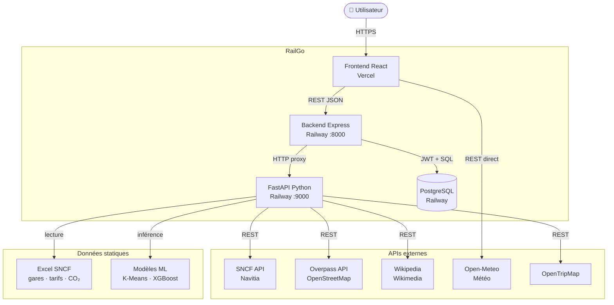
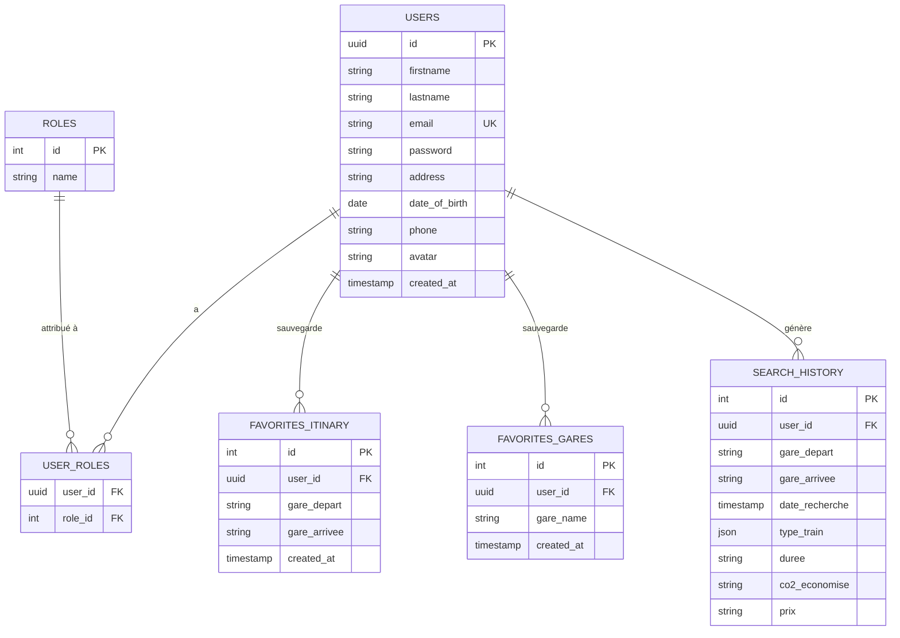
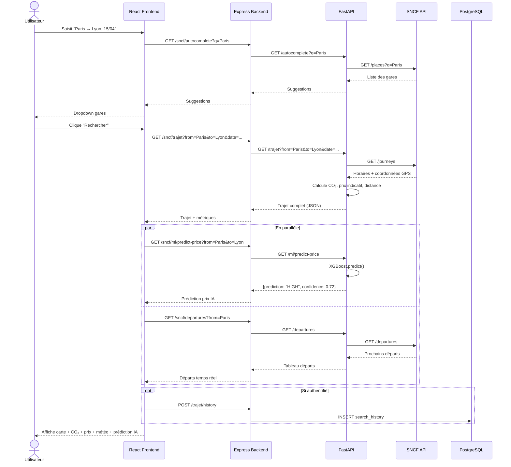
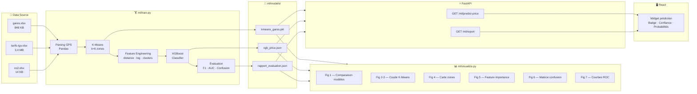
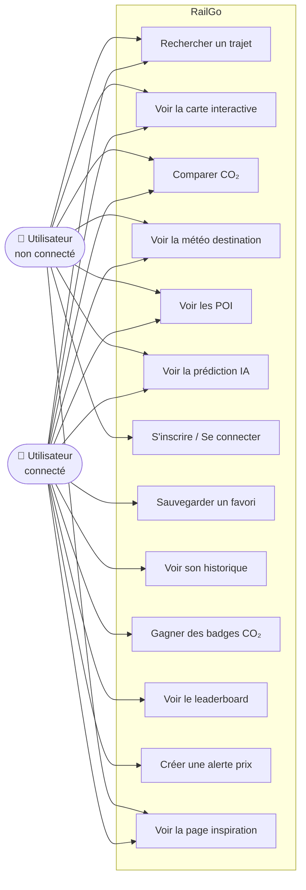
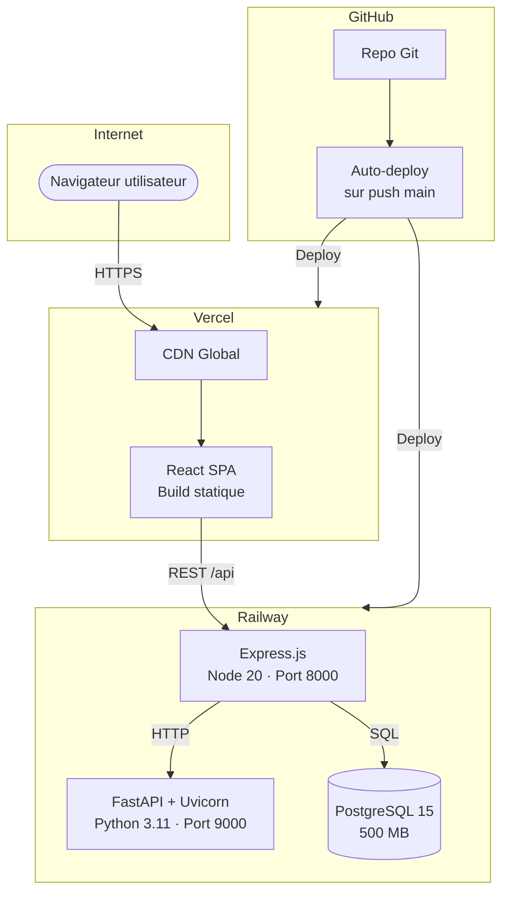

# Diagrammes — RailGo

> Les diagrammes utilisent la syntaxe **Mermaid** qui s'affiche directement sur GitHub.

---

## 1. Architecture globale (C4 — Contexte)

---

## 2. Schéma de la base de données (ERD)

---

## 3. Flux de données — Recherche d'un trajet

---

## 4. Pipeline ML — Flux de données

---

## 5. Diagramme de cas d'utilisation (Use Case)

---

## 6. Modèle de déploiement

