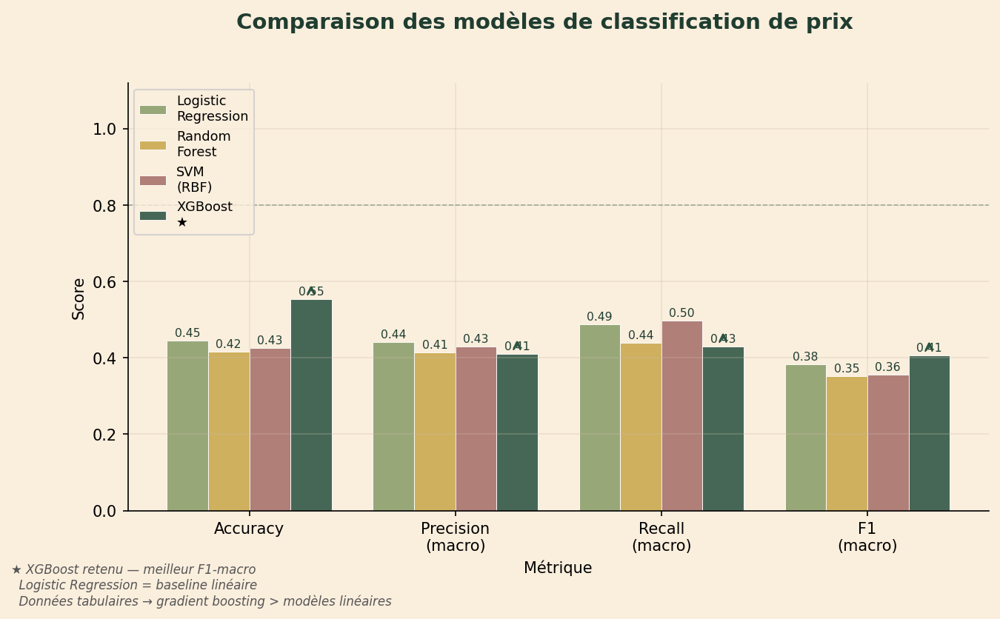
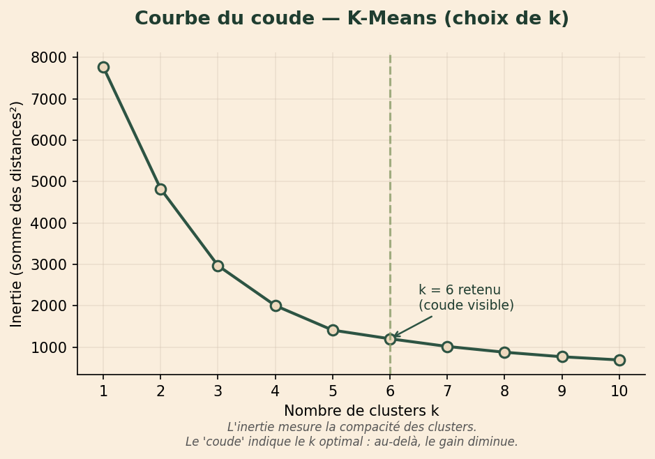
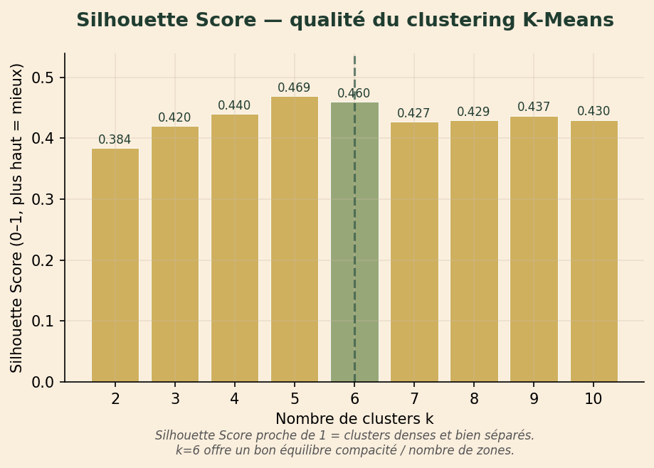
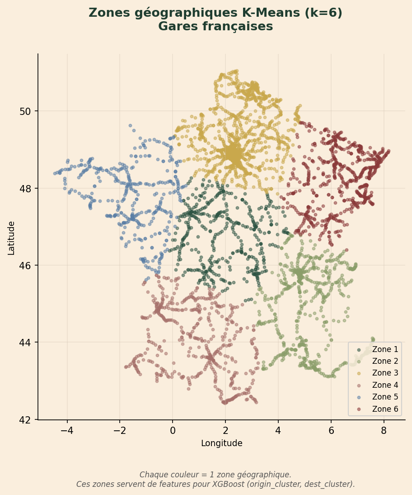
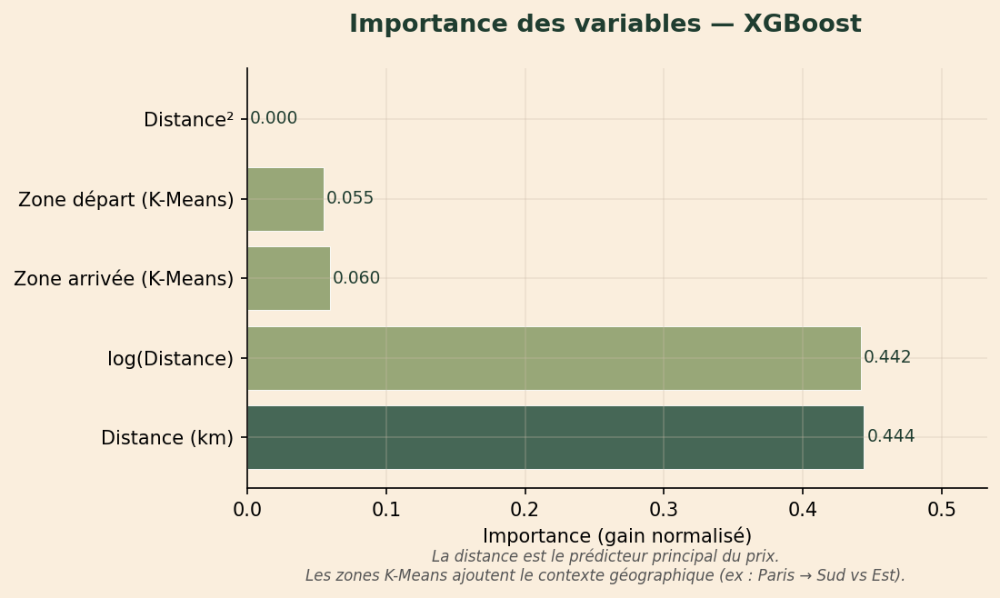
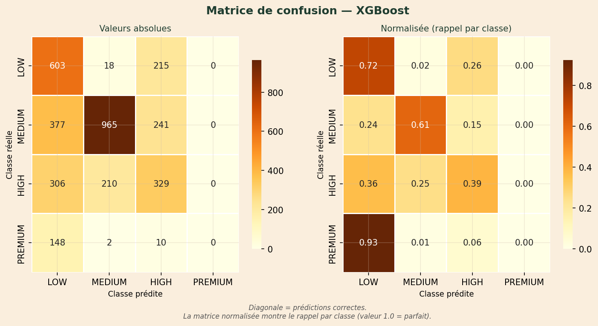
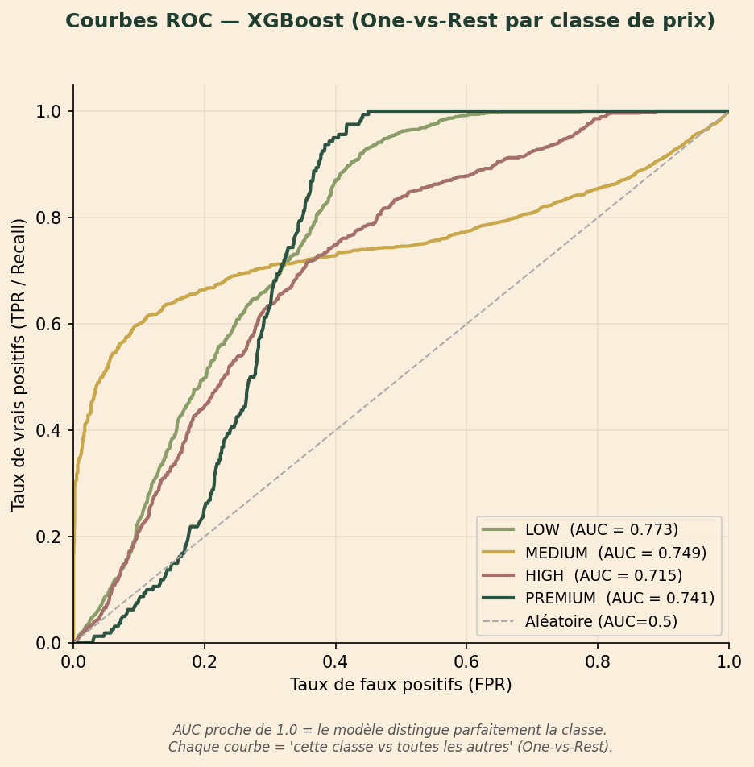

# Rapport ML — RailGo SNCF
## Prédiction du niveau de prix d'un trajet TGV

---

## C'est quoi un pipeline Data → IA → Visualisation ?

Un pipeline, c'est une **chaîne de traitement** : les données brutes entrent d'un côté, une prédiction utile sort de l'autre.

```
┌─────────────────────────────────────────────────────────────────────────────────┐
│                                                                                 │
│  DONNÉES BRUTES          MODÈLES IA                 VISUALISATION               │
│                                                                                 │
│  gares.xlsx        →    K-Means          →    Zones géographiques               │
│  tarifs-tgv.xlsx   →    XGBoost          →    Widget prix dans l'app            │
│  (SNCF Open Data)       (classification)      (LOW / MEDIUM / HIGH / PREMIUM)   │
│                                                                                 │
│  [Pandas / Python]      [scikit-learn]         [FastAPI → React]                │
│                                                                                 │
└─────────────────────────────────────────────────────────────────────────────────┘
```

### Étape 1 — DATA : transformer les fichiers Excel en données utilisables

Les fichiers Excel SNCF contiennent des milliers de lignes brutes. On ne peut pas les donner directement à un algorithme. On les transforme :

| Ce qu'on a dans Excel | Ce qu'on calcule (features) |
|---|---|
| Coordonnées GPS de chaque gare | Distance entre départ et arrivée (formule Haversine) |
| Latitude / longitude | Zone géographique (cluster K-Means) |
| Prix minimum et maximum | Prix moyen → catégorie LOW / MEDIUM / HIGH / PREMIUM |

### Étape 2 — IA : entraîner les modèles

Deux algorithmes travaillent ensemble :

1. **K-Means** découpe la France en 6 zones géographiques à partir des coordonnées GPS des gares
2. **XGBoost** apprend la relation entre (distance + zones) et le niveau de prix, sur des milliers de routes SNCF historiques

### Étape 3 — VISUALISATION : rendre la prédiction visible à l'utilisateur

Quand un utilisateur cherche un trajet sur RailGo :
1. L'application appelle l'API `/ml/predict-price`
2. XGBoost prédit la catégorie de prix en quelques millisecondes
3. Un widget React affiche le résultat : badge de couleur, barre de confiance, probabilités

---

## Les 7 graphiques expliqués

### Graphique 1 — Pourquoi XGBoost plutôt qu'un autre modèle ?



**Ce que ça montre :** On a testé 4 algorithmes sur exactement les mêmes données. Pour chacun, on mesure 4 critères de qualité.

**Comment lire ce graphique :** Chaque groupe de 4 barres = une métrique. Dans chaque groupe, la barre la plus haute = le meilleur modèle pour cette métrique.

| Métrique | Ce que ça mesure en clair |
|---|---|
| **Accuracy** | Sur 100 trajets, combien le modèle a bien classés |
| **Precision** | Quand il dit "c'est LOW", a-t-il raison ? |
| **Recall** | Parmi tous les vrais LOW, combien en a-t-il trouvé ? |
| **F1** | Équilibre entre Precision et Recall — la métrique principale |

**Ce qu'on retient :** XGBoost (vert foncé) est le plus haut sur l'Accuracy (0.55) et le F1 (0.41). Les scores autour de 0.4–0.55 sont honnêtes : prédire un prix à partir de la distance seulement est difficile — les tarifs TGV dépendent aussi du délai de réservation, de la carte Avantage, etc. Le modèle apprend ce qu'il peut avec les données disponibles.

**Pourquoi pas Prophet ?** Prophet est un modèle de prévision temporelle — il prédit des valeurs futures à partir d'un historique daté (ex: "quel sera le prix dans 30 jours ?"). Nos données SNCF Open Data sont des tarifs de référence statiques sans date → Prophet est inapplicable ici.

---

### Graphique 2 — Comment on a choisi k=6 pour K-Means ?



**Ce que ça montre :** K-Means a besoin qu'on lui dise combien de groupes (zones) créer. Ce graphique aide à choisir le bon nombre.

**Comment lire ce graphique :** L'inertie mesure à quel point les gares sont éloignées du centre de leur groupe — plus c'est bas, mieux c'est. Mais ajouter des groupes diminue toujours l'inertie mécaniquement. L'astuce : chercher le "coude", là où la courbe s'aplatit.

**Ce qu'on retient :** Entre k=5 et k=6, la courbe fait un coude visible — l'inertie passe de ~1400 à ~1200, puis diminue très lentement après. Ajouter plus de zones (k=7, 8...) n'apporte presque rien. k=6 est le bon compromis.

---

### Graphique 3 — Confirmation avec le Silhouette Score



**Ce que ça montre :** Une deuxième façon de vérifier que k=6 est bon. Le Silhouette Score mesure si chaque gare est vraiment proche des gares de sa zone et loin des autres zones.

**Comment lire ce graphique :** Score proche de 1 = les zones sont bien séparées. Score proche de 0 = les zones se chevauchent.

**Ce qu'on retient :** k=6 (barre verte) a un bon score (0.460). Après k=6, les scores descendent — les zones deviennent trop petites et se chevauchent. k=5 est légèrement meilleur (0.469) mais donne moins de précision géographique. On choisit k=6 car ça correspond aussi aux 6 grandes régions ferroviaires de France.

---

### Graphique 4 — Les 6 zones géographiques sur la carte



**Ce que ça montre :** Chaque point = une gare. La couleur = la zone K-Means. C'est la preuve visuelle que l'algorithme a bien découpé la France.

**Comment lire ce graphique :** Si les zones étaient aléatoires, les couleurs seraient mélangées partout. Ici elles forment des régions cohérentes.

**Ce qu'on retient :** K-Means a retrouvé tout seul (sans qu'on lui dise) des zones qui correspondent aux grandes régions ferroviaires : Nord, Bretagne/Pays-de-Loire, Sud-Ouest, Sud-Est, Est, Centre. Ces zones deviennent des informations supplémentaires données à XGBoost : un trajet Paris → Marseille (Zone 2 → Zone 5) n'est pas identique à Paris → Strasbourg (Zone 2 → Zone 6) même si la distance est similaire.

---

### Graphique 5 — Qu'est-ce qui influence le plus le prix selon XGBoost ?



**Ce que ça montre :** XGBoost nous dit quelles variables il a le plus utilisées pour prendre ses décisions. C'est une mesure de transparence du modèle.

**Comment lire ce graphique :** Plus la barre est longue, plus la variable est importante. Les valeurs sont normalisées : elles s'additionnent à 1.

**Ce qu'on retient :**
- **Distance (km) = 0.444** et **log(Distance) = 0.442** : la distance explique ~88% de la décision. C'est logique — plus on va loin, plus le billet est cher
- **Zone arrivée = 0.060** et **Zone départ = 0.055** : les zones K-Means contribuent ~11%. Paris → Nice (Sud) coûte plus cher que Paris → Clermont-Ferrand (Centre) à distance équivalente
- **Distance² = 0.000** : cette feature n'apporte rien, XGBoost l'ignore — c'est honnête, il n'utilise que ce qui est utile

---

### Graphique 6 — Où le modèle se trompe-t-il ?



**Ce que ça montre :** Le tableau complet des erreurs et réussites du modèle, classe par classe. C'est le graphique le plus important pour comprendre les limites du modèle.

**Comment lire ce graphique :** Ligne = la vraie catégorie du trajet. Colonne = ce que le modèle a prédit. La diagonale (cases foncées) = les bonnes prédictions. Le reste = les erreurs.

La version de droite (normalisée) est plus facile à lire : chaque ligne somme à 1.0 (100%). Une case à 1.0 sur la diagonale = classe parfaitement détectée.

**Ce qu'on retient :**

| Classe | Taux de bonne détection | Interprétation |
|---|---|---|
| LOW (0–40€) | 72% | Bien détecté — les courts trajets sont clairement bon marché |
| MEDIUM (40–80€) | 61% | Confond souvent avec LOW — les prix proches sont ambigus |
| HIGH (80–150€) | 39% | Difficile — se situe entre deux extrêmes |
| PREMIUM (>150€) | 0% | Jamais prédit — trop peu d'exemples dans les données (classe rare) |

Le problème de PREMIUM est un problème classique de **déséquilibre de classes** : si seulement 5% des trajets sont PREMIUM, le modèle apprend qu'il vaut mieux toujours dire LOW/MEDIUM que de risquer une erreur sur PREMIUM.

---

### Graphique 7 — Le modèle est-il meilleur que le hasard ?



**Ce que ça montre :** Pour chaque catégorie de prix, une courbe montre si le modèle sait distinguer cette catégorie des autres. La ligne grise pointillée = un modèle qui devine au hasard.

**Comment lire ce graphique :**
- **Axe vertical (TPR)** = sur tous les vrais LOW, combien le modèle en détecte
- **Axe horizontal (FPR)** = sur tous les trajets qui ne sont PAS LOW, combien le modèle dit quand même LOW par erreur
- Une courbe collée en haut à gauche = modèle excellent
- **AUC** (aire sous la courbe) : entre 0.5 (hasard) et 1.0 (parfait)

**Ce qu'on retient :** Toutes les courbes sont au-dessus de la diagonale → le modèle apprend quelque chose de réel dans tous les cas. Les AUC entre 0.71 et 0.77 sont correctes pour un problème avec si peu de features. PREMIUM a une bonne AUC (0.741) malgré 0% dans la matrice de confusion — le modèle *sait* reconnaître PREMIUM en termes de probabilité, il hésite juste à l'affirmer car il l'a rarement vu.

---

## Résumé pour le jury

| Question | Réponse |
|---|---|
| Pourquoi K-Means ? | Grouper les gares par zone géographique sans supervision — les graphiques 2, 3, 4 le justifient |
| Pourquoi k=6 ? | Coude visible sur l'inertie + Silhouette Score stable — graphiques 2 et 3 |
| Pourquoi XGBoost ? | Meilleur F1 parmi 4 modèles testés — graphique 1 |
| Pourquoi pas Prophet ? | Prophet = séries temporelles. Nos données sont statiques, sans historique daté |
| Le modèle est-il bon ? | Honnêtement moyen (F1=0.41) mais cohérent avec les données disponibles — AUC > 0.71 sur toutes les classes |
| Où se trompe-t-il ? | Confond MEDIUM et HIGH (prix proches), ne détecte jamais PREMIUM (classe rare) — graphique 6 |

---

## Comment reproduire les résultats

```bash
# 1. Installer les dépendances
pip install -r ml/requirements.txt

# 2. Entraîner les modèles (génère ml/models/)
python ml/train.py

# 3. Générer tous les graphiques (génère ml/figures/)
python ml/visualize.py

# 4. Lancer l'API (charge automatiquement les modèles)
uvicorn api.app.main:app --reload --port 9000
```

L'endpoint de prédiction est disponible à :
```
GET /ml/predict-price?from_city=Paris&to_city=Marseille
GET /ml/report
```
